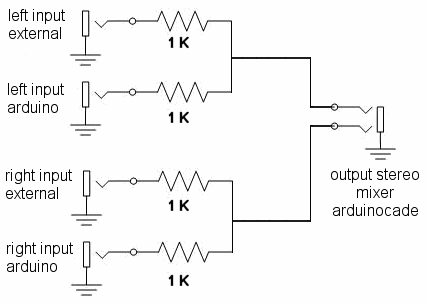

# Belial01
This project aims to continue the legacy of the multiplatform Diskmag Exilium (Belial 01), under an ATMEGA328 (arduinocade). 
First we need a hardware platform, which in this case, will be the arduinocade (Peter Barrett). 
In order to bring the platform closer to the maximum number of people, a first design will be made under an ARDUINO ONE board without the need to change the 16 Mhz glass (sacrificing color), as well as the greater compatibility of pins and hardware of the arduinocade. 
<ul>
 <li><a href='#arduinoide'>IDE Arduino<a/></li>
 <li><a href='#hardware'>Hardware<a/></li>
 <li><a href='#video'>Video<a/></li>
 <li><a href='#mixer'>Audio mixer<a/></li>
 <li><a href='#joystick'>Test joystick ATARI<a/></li>
 <li><a href='#jukebox'>Jukebox<a/></li> 
 <li><a href='#html5'>HTML5<a/></li>
 <li><a href='#box'>Console<a/></li>
</ul>

  
<a name="arduinoid"><h2>IDE Arduino</h2></a>
Tests have been carried out with the IDE 1.8.11.
  
  
<a name="hardware"><h2>Hardware</h2></a>
An ARDUINO ONE plate is used, equipped with ATMEGA328, so it would also be worth DUEMILANOVE or NANO, respecting the location of the pins. 
The same pins as the arduinocade will be used:
<ul>
  <li>Video - D1 and 9</li>
  <li>Audio - D6</li>
</ul>
The specific pins of the arduino will be left free for the future:
<ul>
 <li>A4,A5 - I2C to connect EEPROM LC256</li>
 <li>13,12,11- ISP programmer</li>
 <li>D2 and D3 - PS/2 keyboard</li>
</ul>
For the joystick we'll use:
<ul>
 <li>ATARI - A0,A1,A2,A3,D4 and D5</li>
</ul>
The pins and the infrared module have been removed from the arduinocade, but we will use ATARI and AMSTRAD CPC standard controls instead.

  
<a name="video"><h2>Video</h2></a>
The SPI mode (Dave Schmenk) is used to generate video, similar to the arduinocade, but with the difference, of following with the same 16 Mhz crystal of the arduino, so that a signal is generated:
<ul>
 <li>CVBS RCA</li>
 <li>Black and white NTSC</li>
 <li>Hsync 63.55 microseconds</li>
 <li>320x200 pixels</li>
 <li>Tiles 40x25</li>
 <li>Single resistance 1 K and 470 ohms</li>
</ul>
The circuit to be carried out is as follows:

  
<a name="mixer"><h2>Audio mixer</h2></a>
The audio of arduinocade is characterized by
<ul>
 <li>PWM - pin D6</li>
 <li>Mono output</li>
 <li>4 channels</li>
 <li>Resistance 100 K</li>
</ul>
I have decided to continue using pin 6 for compatibility, but I have replaced the 100 K fixed resistor with a 100 K logarithmic pontentiometer, which allows the volume to be adjusted. 

I have also added a simple passive audio mixer, so we can mix the output of the arduinocade MONO with a stereo audio input. To do this, 1 K resistors must be used for each input:

Thanks to this mixer, we can play background music from external audio devices, while the music of the arduinocade plays.

  
<a name="joystick"><h2>Test ATARI joystick</h2></a>
I have created an ATARI joystick test program for Arduino, which allows us to test the button presses:

<a href="https://github.com/rpsubc8/Belial01/tree/master/arduino/joystickTestDB9">joystickTestDB9</a>
 

The standard of ATARI and AMSTRAD CPC of common mass, PULLUP, is used and the pins to be used in ARDUINO are
<ul>
 <li>Up - 14 (A0)</li>
 <li>Down - 15 (A1)</li>
 <li>Left - 16 (A2)</li>
 <li>Right - 17 (A3)</li>
 <li>A - 4</li>
 <li>B - 5</li>
</ul>
The representation of the DB9 connector is as follows

The circuit is very simple:

  

<a name="jukebox"><h2>Jukebox</h2></a>

We have:
<ul>
 <li>Server part (mobile or computer) in web browser that receives requests for sound commands, via audio tones</li>
 <li>Arduinocade generating song control commands via sound</li>
</ul>
Basically, the arduinocade sends audio tones to a web application that decodes them, so that depending on the command, a song is executed. 

<a href="https://github.com/rpsubc8/jukeboxDTMF">JUKEBOX DTMF</a>
 

<a href="https://rpsubc8.github.io/jukeboxDTMF/html5/jukeboxdtmf.html">JUKEBOX DTMF (online)</a>
 
The tones that are generated are square monotones, but of 2 types:
<ul>
 <li>With 63.55 microsecond NTSC synchronism</li>
 <li>Normal without video sync interruption</li>
</ul>
In the first case, multiple tones are generated from the horizontal video synchronism, so that the drawing on the screen does not stop, but the wave is not pure. So, in the HTML5 part, we must have removed the DTMF checkbox, that is to say, we will hear monotone tones, and we must have activated the NTSC checkbox. 
For the second case, the drawing on the screen will be stopped each time sound is generated, but a purer wave will be generated. In the HTML5 part we must have removed the DTMF checkbox and the NTSC.

The commands that are sent as nonotone are:
<ul>
 <li>#00* - Track 0</li>
 <li>#01* - Track 1</li>
 <li>#02* - Track 2</li>
 <li>#04* - Track 3</li>
 <li>#07* - Track 4</li>
 <li>#0D* - Track 5</li>
 <li>#10* - Track 6</li> 
 <li>#11* - Track 7</li> 
 <li>#12* - Track 8</li> 
 <li>#14* - Track 9</li> 
 <li>#24* - Track 10</li> 
 <li>#20* - Next Track</li> 
 <li>#21* - Last Track</li> 
 <li>#22* - Play/Pause</li>
 <li>#17* - + Volume</li> 
 <li>#1D* - - Volume</li> 
</ul>
Tone to Hz conversion (taking video):
<ul>
 <li>0 - 1336 Hz</li>
 <li>1 - 697 Hz</li>
 <li>4 - 770 Hz</li>
 <li>7 - 852 Hz</li>
 <li>D - 1633 Hz</li>
 <li># - 561,98718669215 Hz</li>
 <li>* - 393,3910306845 Hz</li>
 <li>2 - 302,60848514192 Hz</li>
</ul>
Tone to Hz conversion without NTSC (no video output)
<ul>
 <li>0 - 1336 Hz</li>
 <li>1 - 697 Hz</li>
 <li>4 - 770 Hz</li>
 <li>7 - 852 Hz</li>
 <li>D - 1633 Hz</li>
 <li># - 1477 Hz</li>
 <li>* - 941 Hz</li>
 <li>2 - 1209 Hz</li>
</ul>
From the Arduino application, we can use the buttons on the controller:
<ul>
 <li>Up - Volume up</li>
 <li>Down - Volume Down</li>
 <li>Left - previous song</li>
 <li>Right - Next song</li>
 <li>A - Play/Pause</li>
 <li>B - NTSC mode without stopping drawing on the screen, or without interruptions, stopping drawing</li>
</ul>
For this test, an extra slow mode has been used (500 ms tone, 500 ms silence) and with 4 sending tones #xx*, but by modifying the code we can put the FAST mode with only 2 tones and maximum speed. So, we must also put these options in the web decoder part.
  

<a name="html5"><h2>HTML5</h2></a>
I've created several tools:
<ul>
 <li>Image to Tiles Converter (remove repeats)</li>
 <li>40x25 visual simulator of the entire arduinocade memory map in HTML5</li>
 <li>Joystick simulation in HTML5</li>
 <li>Sound simulation in HTML5</li>
</ul>
In this way, you can see and interact, just as if you had an arduinocade, but from the browser. Unfortunately, all the js code I use is for my own use, so it's not comfortable for the end user, and I haven't uploaded it to the repository. The Arduino code is uploaded.
  

<a name="box"><h2>Console</h2></a>
The capture of the joystick test in the arduino:

The capture of the jukebox in the arduino:

It can be put in a simple wooden or plastic box.

  
