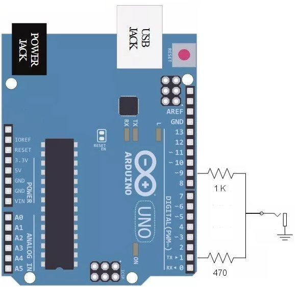
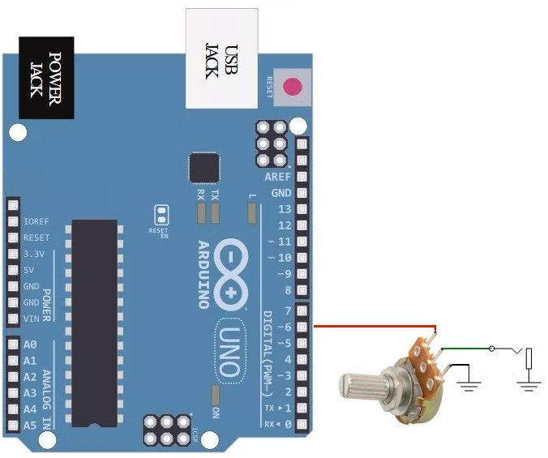
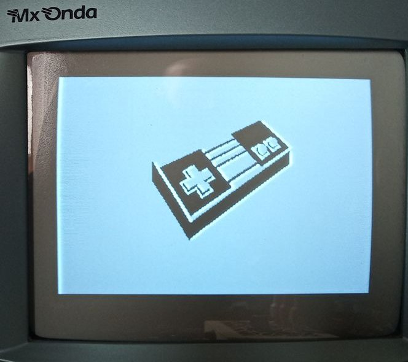
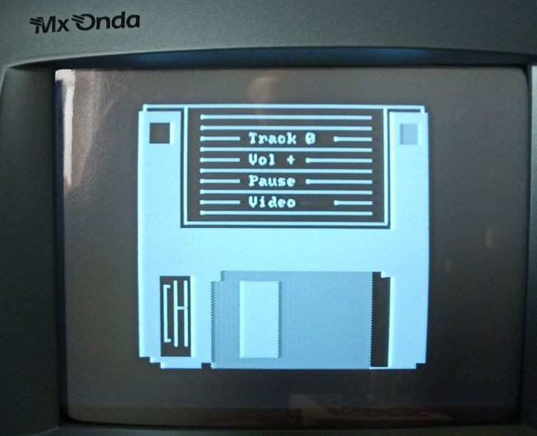

# Belial01
Este proyecto pretende continuar con el legado de la Diskmag multiplataforma Exilium (Belial 01), bajo un ATMEGA328 (arduinocade). 
Primero necesitamos una plataforma hardware, que en este caso, será el arduinocade (Peter Barrett). 
Para poder acercar la plataforma al máximo número de personas, se realizará un primer diseño bajo una placa de ARDUINO UNO sin necesidad de cambiar el cristal de 16 Mhz (sacrificando el color), así como la mayor compatibilidad de pines y hardware del arduinocade. 
<ul>
 <li><a href='#arduinoide'>IDE Arduino<a/></li>
 <li><a href='#hardware'>Hardware<a/></li>
 <li><a href='#video'>Video<a/></li>
 <li><a href='#mixer'>Mezclador audio<a/></li>
 <li><a href='#joystick'>Test joystick ATARI<a/></li>
 <li><a href='#jukebox'>Jukebox<a/></li> 
 <li><a href='#html5'>HTML5<a/></li>
 <li><a href='#box'>Consola<a/></li>
</ul>

  
<a name="arduinoide"><h2>IDE Arduino</h2></a>
Se han realizado pruebas con el IDE 1.8.11.
  

  
<a name="hardware"><h2>Hardware</h2></a>
Se utiliza una placa ARDUINO UNO, dotada de ATMEGA328, así que también valdría DUEMILANOVE o NANO, respetando la localización de los pines. 
Se hará uso de los mismos pines del arduinocade:
<ul>
 <li>Video - D1 y 9</li>
 <li>Audio - D6</li>
</ul>
Se dejarán libres para futuro los pines específicos del arduino:
<ul>
 <li>A4,A5 - I2C para conectar EEPROM LC256</li>
 <li>13,12,11- Programador ISP</li>
 <li>D2 y D3 - Teclado PS/2</li> 
</ul>
Para el joystick usaremos:
<ul>
 <li>ATARI - A0,A1,A2,A3,D4 y D5</li> 
</ul>
Se ha quitado los pines y el módulo de infrarojos del arduinocade, pero a cambio usaremos mandos de norma ATARI y AMSTRAD CPC.
  

<a name="video"><h2>Video</h2></a>
Se utiliza el modo SPI (Dave Schmenk) para generar video, similar al arduinocade, pero con la diferencia, de seguir con el mismo cristal de 16 Mhz del arduino, de forma que se genera una señal:
<ul>
 <li>CVBS RCA</li>
 <li>NTSC blanco y negro</li>
 <li>Hsync 63.55 microsegundos</li>
 <li>320x200 pixels</li>
 <li>Tiles 40x25</li>
 <li>DAC simple resistencia 1 K y 470 ohmios</li>
</ul>
El circuito a realizar es el siguiente:

  

<a name="mixer"><h2>Mezclador audio</h2></a>
El audio de arduinocade se caracteriza por:
<ul>
 <li>PWM - pin D6</li>
 <li>Salida mono</li>
 <li>4 canales</li>
 <li>Resistencia 100 K</li> 
</ul>
He decidido seguir usando el pin 6 de audio para compatibilidad, pero he sustituido la resistencia fija de 100 K por un pontenciómetro Logaritmico de 100 K, que permite regular el volumen. 

También he añadido un mezclador de audio pasivo simple, de manera que podemos mezclar la salida del arduinocade MONO con una entrada de audio estereo. Para ello debe usarse resistencias de 1 K para cada entrada:

Gracias a este mezclador, podremos poner música de fondo de dispositivos de audio externos, mientras suena la música del arduinocade.
  

<a name="joystick"><h2>Test joystick ATARI</h2></a>
He creado un programa de Test de joystick ATARI para Arduino, que nos permite testear la pulsación de los botones:

<a href="https://github.com/rpsubc8/Belial01/tree/master/arduino/joystickTestDB9">joystickTestDB9</a>

Se usa la norma de ATARI y AMSTRAD CPC de masa común, PULLUP, y los pines a usar en ARDUINO son:
<ul>
 <li>Arriba - 14 (A0)</li>
 <li>Abajo - 15 (A1)</li>
 <li>Izquierda - 16 (A2)</li>
 <li>Derecha - 17 (A3)</li>
 <li>A - 4</li>
 <li>B - 5</li>
</ul>
La representación del conector DB9 es la siguiente:

El circuito es muy simple:

  

<a name="jukebox"><h2>Jukebox</h2></a>

Disponemos de:
<ul>
 <li>Parte servidora (móvil u ordenador) en navegador web que recibe peticiones de comandos de sonido, via tonos de audio</li>
 <li>Arduinocade generando comandos de control de canciones via sonido</li>
</ul>
Básicamente, el arduinocade envia tonos de audio a una aplicación web que los decodifica, para en función del comando, ejecutar una canción. 

<a href="https://github.com/rpsubc8/jukeboxDTMF">JUKEBOX DTMF (github)</a>
 

<a href="https://rpsubc8.github.io/jukeboxDTMF/html5/jukeboxdtmf.html">JUKEBOX DTMF (online)</a>
 
Los tonos que se generan son  monotono cuadrados, pero de 2 tipos:
<ul>
 <li>Con sincronismo NTSC de 63.55 microsegundos</li>
 <li>Normales sin interrupción de sincronismo de video</li>
</ul>
En el primer caso, se generan unos tonos múltiplos del sincronismo horizontal de video, de forma que no se deja de dibujar en pantalla, pero la onda no es pura. Debemos pues en la parte HTML5, tener quitado el checkbox DTMF, es decir, escucharemos tonos monotono, y debemos tener activa la casilla NTSC. 
Para el segundo caso, se dejará de dibujar en pantalla cada vez que se genere sonido, pero se generará una onda más pura. Debemos en la parte HTML5 tener quitado el checkbox DTMF y el NTSC.

Los comandos que se envian como nonotono son:
<ul>
 <li>#00* - Track 0</li>
 <li>#01* - Track 1</li>
 <li>#02* - Track 2</li>
 <li>#04* - Track 3</li>
 <li>#07* - Track 4</li>
 <li>#0D* - Track 5</li>
 <li>#10* - Track 6</li> 
 <li>#11* - Track 7</li> 
 <li>#12* - Track 8</li> 
 <li>#14* - Track 9</li> 
 <li>#24* - Track 10</li> 
 <li>#20* - Next Track</li> 
 <li>#21* - Last Track</li> 
 <li>#22* - Play/Pause</li> 
 <li>#17* - + Volumen</li> 
 <li>#1D* - - Volumen</li> 
</ul>
La conversión de tono a Hz con NTSC (sacando video):
<ul>
 <li>0 - 1336 Hz</li>
 <li>1 - 697 Hz</li>
 <li>4 - 770 Hz</li>
 <li>7 - 852 Hz</li>
 <li>D - 1633 Hz</li>
 <li># - 561,98718669215 Hz</li>
 <li>* - 393,3910306845 Hz</li>
 <li>2 - 302,60848514192 Hz</li>
</ul>
La conversión de tono a Hz sin NTSC (sin sacar video):
<ul>
 <li>0 - 1336 Hz</li>
 <li>1 - 697 Hz</li>
 <li>4 - 770 Hz</li>
 <li>7 - 852 Hz</li>
 <li>D - 1633 Hz</li>
 <li># - 1477 Hz</li>
 <li>* - 941 Hz</li>
 <li>2 - 1209 Hz</li>
</ul>
Desde la aplicación en Arduino, podemos usar los botones del mando:
<ul>
 <li>Arriba - Subir volumen</li>
 <li>Abajo - Bajar volumen</li>
 <li>Izquierda - Canción anterior</li>
 <li>Derecha - Canción siguiente</li>
 <li>A - Play/Pause</li>
 <li>B - Modo NTSC sin dejar de dibujar en pantalla, o sin interrupciones, dejando de dibujar</li>
</ul>
Para esta prueba, se ha usado un modo extra lento (500 ms tono, 500 ms silencio) y con 4 tonos de envio #xx*, pero modificando el código podemos poner el modo FAST con sólo 2 tonos y máxima velocidad. Debemos pues, también poner dichas opciones en la parte decodificador web.
  

<a name="html5"><h2>HTML5</h2></a>
He creado varias herramientas:
<ul>
 <li>Conversor de imágenes a Tiles (eliminación de repetidos)</li>
 <li>Simulador visual 40x25 de todo el mapa de memoria del arduinocade en HTML5</li>
 <li>Simulación de Joystick en HTML5</li>
 <li>Simulación de sonido en HTML5</li>
</ul>
De esta forma, se puede ver e interactuar, tal y como si se dispusiera de un arduinocade, pero desde el navegador. Lamentablemente, todo el código js que utilizo es de uso propio, por lo que no es cómodo al usuario final, y no lo he subido al repositorio. El código de Arduino si esta subido.
  

<a name="box"><h2>Consola</h2></a>
La captura del test del joystick en el arduino:

La captura del Jukebox en el arduino:

Se puede meter en una simple caja de madera o de plástico.

  
